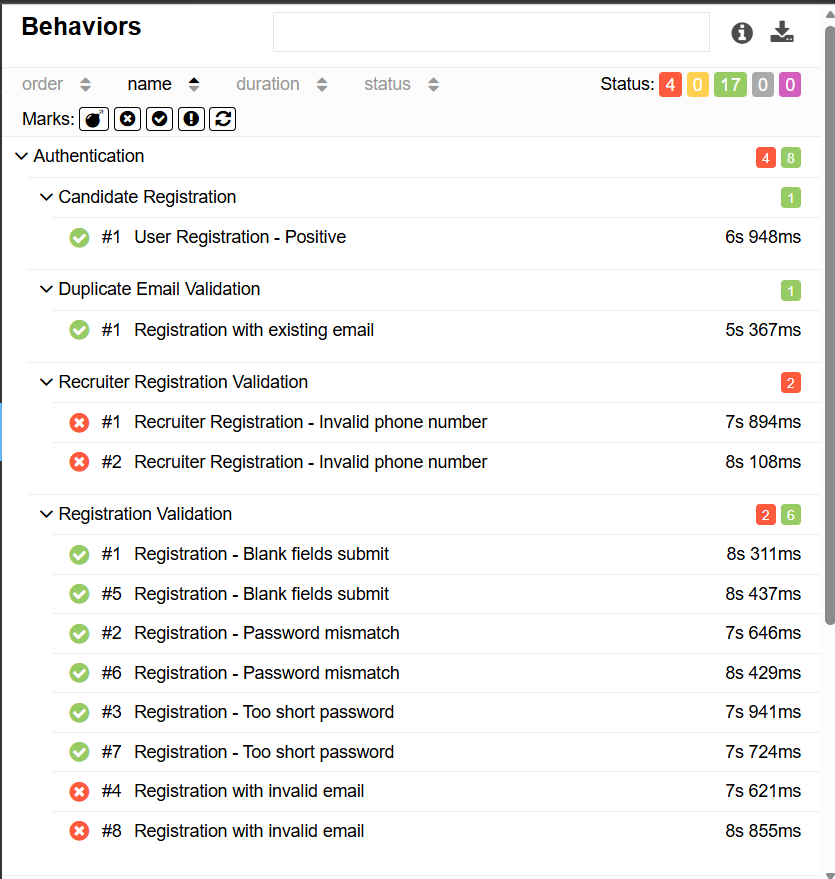

# 🧪 labsqajobs.qaharbor.com — Automation Testing Project

A end-to-end UI automation testing framework built for [labsqajobs.qaharbor.com](https://labsqajobs.qaharbor.com/) using **Playwright**, **pytest**, and **Allure Report**.This project follows the **Page Object Model (POM)** pattern and project covers authentication, registration, job flow, and profile management scenarios — both positive and negative test cases.

---

## 👨‍💻 Author

**Md. Nafijul Islam**   
🔗 [GitHub](https://github.com/mdnafijulislambd/Final_Project.git)

---

## 🛠️ Tech Stack

| Tool | Purpose |
|---|---|
| Python 3.x | Programming language |
| Playwright | Browser automation |
| pytest | Test runner & fixture management |
| Allure Report | Test reporting with screenshots |
| XPath | UI element locators |

---

## 📁 Project Structure

```
Final_Project/
│
├── pages/                               # Page Object Model classes
│   ├── base_page.py                     # Parent class — shared actions (click, fill)
│   ├── login_page.py                    # Login & registration navigation
│   ├── registration_page.py             # Candidate & recruiter registration forms
│   ├── jobs_page.py                     # Job search, filter, save actions
│   └── profile_page.py                  # Profile navigation & password change
│
├── utils/                               # Utility & helper modules
│   ├── test_data.py                     # Static credentials + dynamic data generators
│   ├── helpers.py                       # Timestamp-based unique user/recruiter generators
│   └── allure_utils.py                  # Screenshot & log attachment helpers
│
├── tests/                               # All test files
│   ├── test_authentication.py           # Login positive, login negative
│   ├── test_registration.py             # Candidate registration positive & duplicate email
│   ├── test_registration_validation.py  # Invalid email, blank fields, password mismatch, short password, invalid phone
│   ├── test_recruiter_registration.py   # Recruiter registration & login
│   ├── test_job_flow.py                 # Job search, filter, save
│   └── test_profile.py                  # Password change & reset
│
├── conftest.py                          # Playwright browser fixture + auto screenshot on failure
├── requirements.txt                     # Project dependencies
└── README.md                            # Project documentation
```

---

## ✅ Test Cases

### 🔐 Authentication

| TC ID | Test Case | Type | Manual Status | Auto Status |
|---|---|---|---|---|
| TC_001 | Candidate registration & login | Positive |  Pass |  Done |
| TC_002 | Registration with existing email | Negative |  Pass |  Done |
| TC_003 | Registration with invalid email format | Negative |  Fail |  Done |
| TC_004 | Recruiter registration & login | Positive |  Pass |  Done |
| TC_005 | Password reset email with valid email | Positive |  Pass |  Not Started |
| TC_011 | Login with incorrect password | Negative |  Pass |  Done |
| TC_012 | Login with empty fields | Negative |  Pass |  Done |
| TC_015 | Remember Me — stay logged in after restart | Positive |  Pass |  Done |

### 👤 Profile

| TC ID | Test Case | Type | Manual Status | Auto Status |
|---|---|---|---|---|
| TC_006 | Change password & login with new password | Positive |  Pass |  Done |
| TC_013 | Update profile information | Positive |  Pass |  Done |

### 💼 Job Flow

| TC ID | Test Case | Type | Manual Status | Auto Status |
|---|---|---|---|---|
| TC_007 | Search job → login required → save → verify saved | E2E |  Fail |  Not Automated |
| TC_008 | Login → filter jobs → save job → verify saved list | Positive |  Pass |  Done |
| TC_009 | Login → filter by On-site → open first job | Positive |  Pass |  Done |
| TC_010 | Login → navigate to Post a Job page | Positive |  Pass |  Done |
| TC_014 | Search with no-result location filter | Negative |  Pass |  Done |

### 📋 Registration Validation

| TC ID | Test Case | Type | Auto Status |
|---|---|---|---|
| — | Blank fields submit | Negative |  Done |
| — | Password mismatch | Negative |  Done |
| — | Too short password | Negative |  Done |
| — | Recruiter invalid phone number | Negative |  Done |

---

## ⚙️ Setup & Installation

### 1. Clone the repository

```bash
git clone https://github.com/mdnafijulislambd/Final_Project.git
cd Final_Project
```

### 2. Create virtual environment (recommended)

```bash
python -m venv venv

# Windows
venv\Scripts\activate

# Mac/Linux
source venv/bin/activate
```

### 3. Install dependencies

```bash
pip install pytest playwright allure-pytest
playwright install
```

---

## ▶️ How to Run Tests

### Run all tests

```bash
pytest
```

### Run a specific test file

```bash
pytest tests/test_authentication.py
pytest tests/test_registration.py
pytest tests/test_registration_validation.py
pytest tests/test_job_flow.py
pytest tests/test_profile.py
```

### Run a specific test case by name

```bash
pytest -k "test_login_positive"
```

### Run with Allure reporting

```bash
pytest --alluredir=allure-results
allure serve allure-results
```

---

## 📊 Allure Report Features


<br/>




- This project has 21 automated test cases covering authentication, registration, job flow and profile management. Out of 21 tests, 17 passed and 4 failed. The 4 failures are not mistakes in the automation code — the application itself is accepting invalid email format and invalid phone number without showing any validation error. These are real bugs in the application. I found them through automation and documented them in the Allure report under the Product Defects category.

---


## 🏗️ Design Pattern

This project follows the **Page Object Model (POM)** pattern:

- Every page of the application has a dedicated class inside `pages/`
- `BasePage` acts as the parent class with shared actions like `click()`, `fill()`
- Test files only call page methods — no raw locators inside test code
- This keeps tests clean, readable, and easy to maintain

---

## 📌 Project Info

| Field | Details |
|---|---|
| Application | labsqajobs.qaharbor.com |
| Environment | Live |
| Browser | Chromium (via Playwright) |
| Test Execution Mode | Headed (headless=False) |
| Report Tool | Allure |
